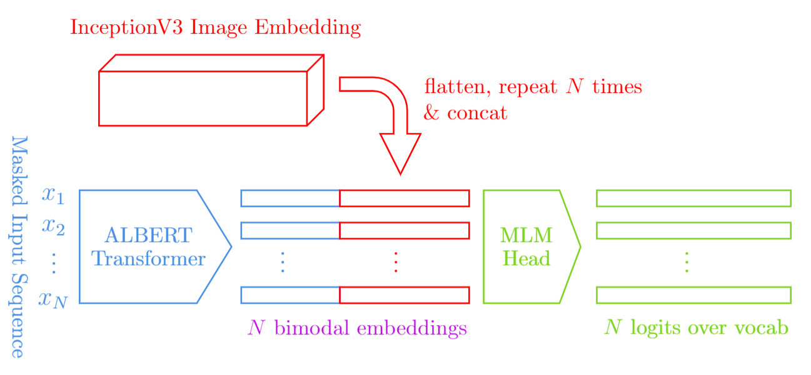
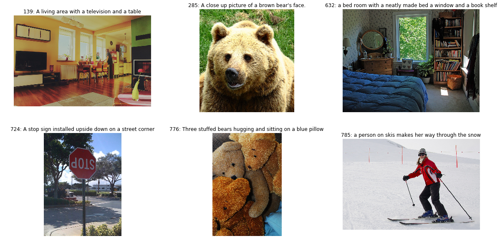

# Image Captioning with Bimodal Transformers

In this notebook we are going to be using COCO captioned image data to build a model that produces natural language descriptions of given images.

We will be using a InceptionV3 convolutional neural network pretrained on classifying imagenet images and an ALBERT transformer network pretrained on a general language modelling task.

We will construct the bimodal transformer to aggregate image and language information. The following is an outline of the model architecture:




```python
from datetime import datetime 
from functools import partial
from itertools import chain, cycle
import json
import multiprocessing
import os
from pathlib import Path
import time
from typing import Tuple, List

import numpy as np
from sklearn.model_selection import train_test_split
import matplotlib.pyplot as plt
%matplotlib inline

import cv2
import tensorflow as tf
import transformers

print('Physical Devices:\n', tf.config.list_physical_devices(), '\n')
%load_ext tensorboard

DATASETS_PATH = os.environ['DATASETS_PATH']
MSCOCO_PATH = f'{DATASETS_PATH}/MSCOCO_2017'
COCO_VERSION = 'val2017'
LOAD_COCO_PREPROC_CACHE_IF_EXISTS = True

PRETRAINED_TRANSFORMER_VERSION = 'albert-base-v2'
Transformer = transformers.TFAlbertModel
Tokenizer = transformers.AlbertTokenizer
MLMHead = transformers.modeling_tf_albert.TFAlbertMLMHead

stamp = datetime.now().strftime("%Y%m%d-%H%M%S")
OUTPUTS_DIR = f'./outputs/{stamp}'
print('\nOutput Directory:', OUTPUTS_DIR)
```

    Physical Devices:
     [PhysicalDevice(name='/physical_device:CPU:0', device_type='CPU'), PhysicalDevice(name='/physical_device:GPU:0', device_type='GPU')] 
    
    
    Output Directory: ./outputs/20200423-222903
    


```python
log_dir = f'{OUTPUTS_DIR}/logs'
summary_writer = tf.summary.create_file_writer(log_dir)
tf.summary.trace_on(graph=True) 
print(log_dir)
```

    ./outputs/20200423-222903/logs
    

## Loading COCO

Firstly, we are going to load the COCO data. For the sakes of this demonstration I am running this on my limited machine, as such we will only load in the 5000 validation samples. 


```python
captions_path = f'{MSCOCO_PATH}/annotations/captions_{COCO_VERSION}.json'
coco_captions = json.loads(Path(captions_path).read_text())
coco_captions = {
    item['image_id']: item['caption']
    for item in coco_captions['annotations']
}
```


```python
images_path = f'{MSCOCO_PATH}/{COCO_VERSION}'
image_paths = Path(images_path).glob('*.jpg')
coco_imgs = {
    int(path.name.split('.')[0]): cv2.imread(str(path))
    for path in image_paths
}
```


```python
coco_data: List[Tuple[np.ndarray, str]] = [
    (img_id, coco_imgs[img_id], coco_captions[img_id])
    for img_id in coco_imgs
    if img_id in coco_captions
]
```


```python
fig, axs = plt.subplots(2, 3, figsize=(20, 10))
for i, ax in enumerate(chain(list(axs.flatten()))):
    img_id, img, cap = coco_data[i]
    ax.imshow(cv2.cvtColor(img, cv2.COLOR_BGR2RGB))
    ax.set_title(f'{img_id}: {cap}')
    ax.axis('off')
plt.show()
```





## Preprocessing the Data

In order to reduce the amount of learning that our model needs to do we are using the pretrained InceptionV3 model. To do this we will pass each of our images through InceptionV3 and extract the activations in the penultimate layers. These extracted tensors are our "image embeddings" and they capture the semantic content of the input in a ready-to-use state for downstream tasks. 

Additionally, our transformer network, ALBERT, only ingests sentences that have been tokenized. As such, we extract "caption encodings" using the tokenizer. This replaces (approximate) morphemes in the sentence with assigned identifiers. 

Once we have preprocessed the data we will store it in a cache for retrieval in the future. Additionally this helps relieve memory limitations as we can now discard the InceptionV3 model for the training phase. In order to keep track of the information in the cache we will also store the COCO image identifier (IID). 


```python
def inceptionv3_preprocess(img, img_size=(128, 129)):
    img = cv2.cvtColor(img, cv2.COLOR_BGR2RGB)
    img = cv2.resize(img, img_size)
    return tf.keras.applications.inception_v3.preprocess_input(img)
```


```python
def create_image_features_extract_model():
    image_model = tf.keras.applications.InceptionV3(include_top=False,
                                                    weights='imagenet')
    new_input = image_model.input
    hidden_layer = image_model.layers[-1].output
    return tf.keras.Model(new_input, hidden_layer)
```


```python
tokenizer = Tokenizer.from_pretrained(PRETRAINED_TRANSFORMER_VERSION)
```


```python
print('Vocab size:', tokenizer.vocab_size)
for (name, token), iden in zip(tokenizer.special_tokens_map.items(), 
                               tokenizer.all_special_ids):
    print(f'{name}: {token}, ID: {iden}')
print()
print('Input:', cap)
print('Encoded:', tokenizer.encode(cap))
```

    Vocab size: 30000
    bos_token: [CLS], ID: 3
    eos_token: [SEP], ID: 0
    unk_token: <unk>, ID: 2
    sep_token: [SEP], ID: 1
    pad_token: <pad>, ID: 4
    
    Input: a person on skis makes her way through the snow
    Encoded: [2, 21, 840, 27, 7185, 18, 1364, 36, 161, 120, 14, 2224, 3]
    


```python
def batch(iterable, n=1):
    l = len(iterable)
    for ndx in range(0, l, n):
        yield iterable[ndx:min(ndx + n, l)]

def coco_preprocess_batch(coco_batch: list, 
                          image_feature_extract_model: tf.keras.Model,
                          tokenizer: Tokenizer):
    iids = [iid for iid, _, _ in coco_batch]
    imgs = [img for _, img, _ in coco_batch]
    caps = [cap for _, _, cap in coco_batch]
    
    cap_encodings = [tokenizer.encode(cap) for cap in caps]
    x = np.array([inceptionv3_preprocess(img) for img in imgs])
    img_embeddings = image_feature_extract_model(x)
    return list(zip(iids, img_embeddings, cap_encodings))

def make_coco_preprocessed(tokenizer: Tokenizer,
                           batch_size=4):
    image_feature_extract_model = create_image_features_extract_model()
    return [
        record
        for coco_batch in batch(coco_data, batch_size)
        for record in coco_preprocess_batch(coco_batch,
                                            image_feature_extract_model,
                                            tokenizer)
    ]
```

Tensorflow does not have a built-in way to release a model from memory so we have to spin-up a concurrent process using `multiprocess` that does the preprocessing. When this process terminates it will clear the memory.


```python
preprocessed_coco_cache_dir = Path(f'{MSCOCO_PATH}/inception-{PRETRAINED_TRANSFORMER_VERSION}-preprocessed')
preprocessed_coco_cache_dir.mkdir(exist_ok=True)
preprocessed_coco_cache_path = preprocessed_coco_cache_dir / f'{COCO_VERSION}.npy'
if preprocessed_coco_cache_path.exists():
    print('Loading cached preprocessed data...')
    coco_preprocessed = list(np.load(preprocessed_coco_cache_path, 
                                     allow_pickle=True))
    coco_preprocessed = [tuple(x) for x in coco_preprocessed]
else:
    print('Preprocessing and creating cache...')
    def preprocess_and_cache():
        coco_preprocessed = make_coco_preprocessed(tokenizer)
        np.save(preprocessed_coco_cache_path, np.array(coco_preprocessed))
    
    # Using multiprocess to clear Inception GPU usage when process terminates
    p = multiprocessing.Process(target=preprocess_and_cache)
    p.start()
    p.join()
```

    Loading cached preprocessed data...
    


```python
coco_preprocessed[0]
```


    (139,
     <tf.Tensor: shape=(2, 2, 2048), dtype=float32, numpy=
     array([[[2.5995767 , 0.        , 0.4370903 , ..., 0.7036782 ,
              1.0261441 , 3.478441  ],
             [3.5346863 , 0.        , 0.48941162, ..., 0.7036782 ,
              1.0261441 , 3.478441  ]],
     
            [[1.6772687 , 0.        , 2.2373395 , ..., 0.7036782 ,
              1.0261441 , 3.478441  ],
             [1.7453028 , 0.        , 0.43314373, ..., 0.7036782 ,
              1.0261441 , 3.478441  ]]], dtype=float32)>,
     [2, 21, 634, 217, 29, 21, 633, 17, 21, 859, 3])


## Creating Train-Test Datasets

In order to train our model we will create train and test datasets from our preprocessed data. The training data will be organised in batches where sequences of varying lengths are collected into matrices. The matrices are filled by padding the shorter sequences with a special token defined by the tokenizer. Later the transformer will be instructed to not pay attention to these padding tokens.


```python
coco_train_data, coco_test_data = train_test_split(coco_preprocessed, test_size=0.2)
outputs = (tf.int32, tf.float32, tf.int32) 

BUFFER_SIZE = 10000
BATCH_SIZE = 8

coco_train = tf.data.Dataset.from_generator(lambda: cycle(coco_train_data), outputs)

# example sample to define the padding shapes
iid_ex, img_emb_ex, cap_enc_ex = next(iter(coco_train))

coco_train = coco_train.shuffle(BUFFER_SIZE)
coco_train = coco_train.padded_batch(
    BATCH_SIZE, 
    padded_shapes=(iid_ex.shape, img_emb_ex.shape, [None]), 
    padding_values=(0, 0.0, tokenizer.pad_token_id)
)

coco_test = tf.data.Dataset.from_generator(lambda: cycle(coco_test_data), outputs)
```


```python
coco_train
```


    <PaddedBatchDataset shapes: ((None,), (None, 2, 2, 2048), (None, None)), types: (tf.int32, tf.float32, tf.int32)>


## Masked Language Modelling

In order to train the caption generator we will learn through a masked language modelling (MLM) scheme. This involves arbitrarily removing tokens in a caption and having the model reconstruct the input. This process is inspired by the [Cloze deletion test](https://en.wikipedia.org/wiki/Cloze_test) from psychology. MLM was introducted by the authors of BERT.


```python
def create_mask_and_input(tar: tf.Tensor, 
                          tokenizer: Tokenizer,
                          prob_mask=0.15,
                          seed=None) -> tf.Tensor:
    """
    prob_mask hyperparams from: https://arxiv.org/pdf/1810.04805.pdf
    """
    if seed is not None:
        tf.random.set_seed(seed)
        
    where_masked = tf.random.uniform(tar.shape) < prob_mask
    for special_token in tokenizer.all_special_ids:
        where_masked &= tar != special_token
    
    mask_tokens = tf.multiply(tokenizer.mask_token_id, 
                              tf.cast(where_masked, tf.int32))
    not_masked = tf.multiply(tar, 1 - tf.cast(where_masked, tf.int32))
    inp = mask_tokens + not_masked
    
    return inp, where_masked
```


```python
train_cap_enc, where_masked = create_mask_and_input(cap_enc, tokenizer)
for i in range(3):
    print(f'Batch Item {i}:')
    print(tokenizer.decode(train_cap_enc[i].numpy()))
    print(tokenizer.decode(cap_enc[i].numpy()))
    print()
```

    Batch Item 0:
    [CLS][MASK] couple of dining trucks are in a parking lot while some[MASK] stand[MASK] sit[MASK] chairs.[SEP]
    [CLS] a couple of dining trucks are in a parking lot while some people stand or sit in chairs.[SEP]
    
    Batch Item 1:
    [CLS] a group of cows standing[MASK] the grass.[SEP]<pad><pad><pad><pad><pad><pad><pad><pad><pad>
    [CLS] a group of cows standing in the grass.[SEP]<pad><pad><pad><pad><pad><pad><pad><pad><pad>
    
    Batch Item 2:
    [CLS] a close up of[MASK] toilet with its lid open[SEP]<pad><pad><pad><pad><pad><pad><pad><pad><pad>
    [CLS] a close up of a toilet with its lid open[SEP]<pad><pad><pad><pad><pad><pad><pad><pad><pad>
    
    

## Defining the Model Architecture


```python
class BimodalMLMTransformer(tf.keras.Model):
    
    def __init__(self, transformer: Transformer, **kwargs):
        super().__init__(**kwargs)
        
        self.transformer = transformer
        self.predictions  = MLMHead(transformer.config, 
                                    transformer.albert.embeddings,
                                    name='predictions')
    
    def call(self, 
             inputs: tf.Tensor, 
             **transformer_kwargs):
        
        img_embs, cap_encs = inputs
        
        outputs = self.transformer(cap_encs, **transformer_kwargs)
        last_hidden_state, *_ = outputs
        batch_size, batch_seq_len, last_hidden_dim = last_hidden_state.shape

        # reshape and repeat image embeddings
        batch_size, *img_emb_shape = img_embs.shape
        img_emb_flattened = tf.reshape(img_embs, (batch_size, np.prod(img_emb_shape)))
        emb_flattened_reps = tf.repeat(tf.expand_dims(img_emb_flattened, 1), 
                                       batch_seq_len, axis=1)
        
        # concatenate the language and image embeddings
        embs_concat = tf.concat([last_hidden_state, emb_flattened_reps], 2)
        
        # generate mlm predictions over input sequence
        training = transformer_kwargs.get('training', False)
        prediction_scores = self.predictions(embs_concat, training=training)

        # Add hidden states and attention if they are here
        outputs = (prediction_scores,) + outputs[2:]

        return outputs
```


```python
transformer = Transformer.from_pretrained(PRETRAINED_TRANSFORMER_VERSION)
```


```python
bm_transformer = BimodalMLMTransformer(transformer)
```


```python
iid, img_emb, cap_enc = next(iter(coco_train))
iid, img_emb, cap_enc
```


    (<tf.Tensor: shape=(8,), dtype=int32, numpy=array([555012, 159112, 515077, 360137,  87875, 577539, 508101, 151857])>,
     <tf.Tensor: shape=(8, 2, 2, 2048), dtype=float32, numpy=
     array([[[[0.        , 0.5482247 , 1.6957445 , ..., 0.        ,
               0.0833936 , 0.        ],
              [0.        , 0.7441787 , 2.422705  , ..., 0.        ,
               0.0833936 , 0.        ]],
     
             [[0.5681179 , 0.5535338 , 2.120743  , ..., 0.        ,
               0.0833936 , 0.        ],
              [0.        , 0.5526198 , 2.2049437 , ..., 0.        ,
               0.0833936 , 0.        ]]],
     
     
            [[[0.        , 1.6364899 , 4.2459726 , ..., 3.3755155 ,
               4.0725217 , 0.84393054],
              [0.        , 0.41202733, 3.7122467 , ..., 3.3755155 ,
               4.0725217 , 0.84393054]],
     
             [[1.1843704 , 0.        , 4.7252355 , ..., 3.3755155 ,
               4.0725217 , 0.84393054],
              [0.9022831 , 0.        , 3.661071  , ..., 3.3755155 ,
               4.0725217 , 0.84393054]]],
     
     
            [[[2.5601292 , 0.        , 4.191546  , ..., 0.        ,
               1.7368774 , 0.38255802],
              [3.0020049 , 0.        , 3.4220638 , ..., 0.        ,
               1.7368774 , 0.38255802]],
     
             [[1.98971   , 0.        , 4.338923  , ..., 0.        ,
               1.7368774 , 0.38255802],
              [2.3175986 , 0.        , 2.7705708 , ..., 0.        ,
               1.7368774 , 0.38255802]]],
     
     
            ...,
     
     
            [[[2.8106852 , 2.9132907 , 3.2015562 , ..., 4.410709  ,
               2.9596634 , 3.196804  ],
              [3.2118912 , 3.5893323 , 3.0155795 , ..., 4.410709  ,
               2.9596634 , 3.196804  ]],
     
             [[0.5912059 , 1.8137878 , 1.9987732 , ..., 4.410709  ,
               2.9596634 , 3.196804  ],
              [1.5511816 , 1.9731815 , 2.9045582 , ..., 4.410709  ,
               2.9596634 , 3.196804  ]]],
     
     
            [[[0.        , 0.        , 0.        , ..., 0.        ,
               1.1718961 , 0.42414942],
              [0.        , 0.        , 0.45936656, ..., 0.        ,
               1.1718961 , 0.42414942]],
     
             [[0.        , 1.1491123 , 0.        , ..., 0.        ,
               1.1718961 , 0.42414942],
              [0.        , 1.2579205 , 0.        , ..., 0.        ,
               1.1718961 , 0.42414942]]],
     
     
            [[[0.80593425, 0.        , 0.        , ..., 2.553032  ,
               0.38391542, 2.0284529 ],
              [1.6143386 , 0.        , 0.33936328, ..., 2.553032  ,
               0.38391542, 2.0284529 ]],
     
             [[1.8743064 , 0.        , 0.21707356, ..., 2.553032  ,
               0.38391542, 2.0284529 ],
              [2.1684284 , 0.        , 0.3196186 , ..., 2.553032  ,
               0.38391542, 2.0284529 ]]]], dtype=float32)>,
     <tf.Tensor: shape=(8, 31), dtype=int32, numpy=
     array([[    2,    21,  4248,   677,    19,   557,   600,   359,     3,
                 0,     0,     0,     0,     0,     0,     0,     0,     0,
                 0,     0,     0,     0,     0,     0,     0,     0,     0,
                 0,     0,     0,     0],
            [    2,    81, 12975, 12982,    18,  3126, 10718,    21,   950,
                20,  5574,    16, 14200,    17,    13,  4673,    69,  4428,
              2198,    29,    21,   359, 12182,    17,  1789,    84, 12879,
                93,  5988,     9,     3],
            [    2,    21,   524,    25,  2094,  1016,    21,  2324,    30,
                25,   791,    21,  1308,     9,     3,     0,     0,     0,
                 0,     0,     0,     0,     0,     0,     0,     0,     0,
                 0,     0,     0,     0],
            [    2,    40,  1961,    29,    21,   840,  1337,    40, 13447,
                 3,     0,     0,     0,     0,     0,     0,     0,     0,
                 0,     0,     0,     0,     0,     0,     0,     0,     0,
                 0,     0,     0,     0],
            [    2,    21,   535, 18941,  2877,   424,    21,  2263,  3382,
                19,    21,   575,     3,     0,     0,     0,     0,     0,
                 0,     0,     0,     0,     0,     0,     0,     0,     0,
                 0,     0,     0,     0],
            [    2,    21,  2557,   503,    16,  7768,    79, 17976,    18,
                15,  7118,    15,    17,    89, 12208,  5752,    18,     9,
                 3,     0,     0,     0,     0,     0,     0,     0,     0,
                 0,     0,     0,     0],
            [    2,   148,    17,    66,  3217,    27,    21,   265,  2252,
                19,    14,  2144,     3,     0,     0,     0,     0,     0,
                 0,     0,     0,     0,     0,     0,     0,     0,     0,
                 0,     0,     0,     0],
            [    2,    40,   315,  1528,    25,   228,   125,    14,  2356,
               131,  6201,     9,     3,     0,     0,     0,     0,     0,
                 0,     0,     0,     0,     0,     0,     0,     0,     0,
                 0,     0,     0,     0]])>)


```python
preds, *_ = bm_transformer((img_emb, cap_enc))
preds
```


    <tf.Tensor: shape=(8, 31, 30000), dtype=float32, numpy=
    array([[[ 0.38514784, -0.10578536,  0.27194962, ...,  0.0883903 ,
              0.25831372, -0.15278041],
            [ 0.3851389 , -0.10575607,  0.2719407 , ...,  0.08838152,
              0.25834125, -0.15273514],
            [ 0.38513964, -0.10576019,  0.2719427 , ...,  0.08838229,
              0.25833645, -0.15274192],
            ...,
            [ 0.38514048, -0.10575603,  0.2719397 , ...,  0.08838047,
              0.25833696, -0.15274322],
            [ 0.38514003, -0.10575815,  0.27194098, ...,  0.0883806 ,
              0.2583365 , -0.15274239],
            [ 0.38513938, -0.10575896,  0.2719419 , ...,  0.08838151,
              0.25833705, -0.1527405 ]],
    
           [[ 0.34563893,  0.06493309,  0.19233231, ..., -0.123661  ,
              0.5162463 , -0.11880597],
            [ 0.3089339 , -0.11884554,  0.0444726 , ...,  0.11283634,
              0.2710466 ,  0.14304903],
            [ 0.21933027, -0.04485522,  0.02163985, ...,  0.13987619,
              0.43377987,  0.14849606],
            ...,
            [ 0.39064637, -0.03900406,  0.02810329, ..., -0.02852581,
              0.59657514,  0.19034635],
            [ 0.14672188,  0.03390632,  0.00601977, ...,  0.0546652 ,
              0.4412638 ,  0.1583906 ],
            [ 0.22745764, -0.01921389, -0.09080154, ...,  0.07015935,
              0.7442309 , -0.05268532]],
    
           [[ 0.12431561, -0.19682479, -0.01949473, ..., -0.10579964,
             -0.2692397 , -0.29040405],
            [ 0.12423401, -0.19676776, -0.01950835, ..., -0.1057829 ,
             -0.2692121 , -0.29035768],
            [ 0.12424254, -0.1967784 , -0.01950494, ..., -0.10578314,
             -0.269212  , -0.29036042],
            ...,
            [ 0.1242482 , -0.19676962, -0.01950915, ..., -0.10578983,
             -0.26921946, -0.2903721 ],
            [ 0.12425143, -0.1967746 , -0.01950779, ..., -0.10579198,
             -0.2692214 , -0.29037112],
            [ 0.1242519 , -0.19677879, -0.01950644, ..., -0.10579079,
             -0.269221  , -0.29036835]],
    
           ...,
    
           [[ 0.28103283,  0.08787497, -0.16013171, ...,  0.19171374,
              0.7232697 ,  0.10481711],
            [ 0.28104484,  0.08788456, -0.16011089, ...,  0.19172105,
              0.72331333,  0.10485093],
            [ 0.28104636,  0.0878853 , -0.16010857, ...,  0.1917181 ,
              0.72331244,  0.10485002],
            ...,
            [ 0.28103995,  0.08789054, -0.16011721, ...,  0.19172071,
              0.7233073 ,  0.10484631],
            [ 0.28104123,  0.08788768, -0.16011679, ...,  0.19171937,
              0.72330743,  0.10484696],
            [ 0.28104255,  0.08788464, -0.1601156 , ...,  0.19172019,
              0.7233088 ,  0.1048481 ]],
    
           [[ 0.07690851,  0.34563947,  0.23494214, ...,  0.53503114,
              0.20721722,  0.3247505 ],
            [ 0.07689448,  0.34567836,  0.23499796, ...,  0.5350531 ,
              0.2073033 ,  0.32485977],
            [ 0.07689009,  0.34567723,  0.23501307, ...,  0.5350681 ,
              0.2073195 ,  0.3248838 ],
            ...,
            [ 0.07689198,  0.34568188,  0.23498523, ...,  0.53505576,
              0.20729347,  0.3248427 ],
            [ 0.07689405,  0.3456771 ,  0.23498647, ...,  0.53505266,
              0.20728886,  0.32484344],
            [ 0.07689513,  0.34567356,  0.23498873, ...,  0.5350524 ,
              0.20728812,  0.32484618]],
    
           [[-0.03557657,  0.16424519,  0.09831114, ...,  0.2223076 ,
              0.24218675,  0.3038033 ],
            [-0.03554904,  0.16428389,  0.09835625, ...,  0.22233246,
              0.242222  ,  0.30382952],
            [-0.0355459 ,  0.16428171,  0.09835963, ...,  0.22233212,
              0.2422185 ,  0.3038282 ],
            ...,
            [-0.03555471,  0.16428268,  0.09834541, ...,  0.22232878,
              0.24221744,  0.30382293],
            [-0.03555518,  0.1642794 ,  0.09834657, ...,  0.22232762,
              0.24221556,  0.30382484],
            [-0.03555476,  0.16427734,  0.09834822, ...,  0.22232726,
              0.24221504,  0.30382684]]], dtype=float32)>


```python
optimizer = tf.keras.optimizers.Adam(learning_rate=1e-5, epsilon=1e-08, clipnorm=1.0)
loss_fn = tf.keras.losses.SparseCategoricalCrossentropy(from_logits=True)

train_acc = tf.keras.metrics.SparseCategoricalAccuracy('accuracy')
train_loss = tf.keras.metrics.Mean(name='train_loss')
```


```python
checkpoint_path = f'{OUTPUTS_DIR}/ckpts'

ckpt = tf.train.Checkpoint(transformer=model,
                           optimizer=optimizer)

ckpt_manager = tf.train.CheckpointManager(ckpt, checkpoint_path, max_to_keep=5)

# if a checkpoint exists, restore the latest checkpoint.
if ckpt_manager.latest_checkpoint:
    ckpt.restore(ckpt_manager.latest_checkpoint)
    print ('Latest checkpoint restored!!')
```


```python
model.summary()
with summary_writer.as_default():
    tf.summary.trace_export(
      name="transformer",
      step=0, profiler_outdir=log_dir)
```


```python
def train_step(model: tf.keras.Model,
               optimizer: tf.keras.optimizers.Optimizer,
               pad_token: int,
               tar: tf.Tensor):
    
    inp, where_masked = create_mask_and_input(tar)
    
    with tf.GradientTape() as tape:
        attention_mask = tf.cast(inp != pad_token, tf.int32)
        logits, *_ = model(inp, 
                           attention_mask=attention_mask,
                           training=True)
        loss = loss_fn(tar[where_masked], logits[where_masked])

    gradients = tape.gradient(loss, model.trainable_variables)
    optimizer.apply_gradients(zip(gradients, model.trainable_variables))

    train_acc(tar[where_masked], logits[where_masked])
    train_loss(loss)
    
    return logits, loss


train_step_signature = [
    tf.TensorSpec(shape=(BATCH_SIZE, MAX_SEQ_SIZE), 
                  dtype=tf.int32),
]


@tf.function(input_signature=train_step_signature)
def train_step_tf(tar):
    train_step(model, optimizer, pad_token, tar)
```


```python
BATCHES_IN_EPOCH = 250
epoch = 0
```


```python
EPOCHS = 300
```


```python
try:
    while epoch < EPOCHS:
        start = time.time()

        train_loss.reset_states()
        train_acc.reset_states()

        for batch, tar in enumerate(train_dataset):
            train_step_tf(tar)

            if batch % 50 == 0:
#                 print ('Epoch {} Batch {} Loss {:.4f} Accuracy {:.4f}'.format(
#                     epoch + 1, batch, train_loss.result(), train_acc.result()))

                with summary_writer.as_default():
                    tf.summary.scalar('loss', train_loss.result(), 
                                      step=epoch)
                    tf.summary.scalar('accuracy', train_acc.result(), 
                                      step=epoch)

            if batch >= BATCHES_IN_EPOCH:
                break

        if (epoch + 1) % 5 == 0:
            ckpt_save_path = ckpt_manager.save()
            print ('Saving checkpoint for epoch {} at {}'.format(epoch+1,
                                                                 ckpt_save_path))

        print ('Epoch {} Loss {:.4f} Accuracy {:.4f}'.format(epoch + 1, 
                                                             train_loss.result(), 
                                                             train_acc.result()))

        print ('Time taken for epoch: {} secs\n'.format(time.time() - start))
        epoch += 1
        
except KeyboardInterrupt:
    print('Manual interrupt')
```


```python
ckpt_loc = 'outputs/20200321-171346/ckpts'
ckpt = tf.train.Checkpoint(transformer=model,
                           optimizer=optimizer)

ckpt_manager = tf.train.CheckpointManager(ckpt, ckpt_loc, max_to_keep=5)

# if a checkpoint exists, restore the latest checkpoint.
if ckpt_manager.latest_checkpoint:
    ckpt.restore(ckpt_manager.latest_checkpoint)
    print ('Latest checkpoint restored!!')
```


```python
ckpt_manager.latest_checkpoint
```
